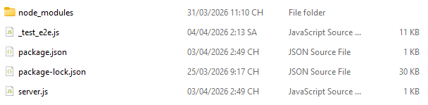
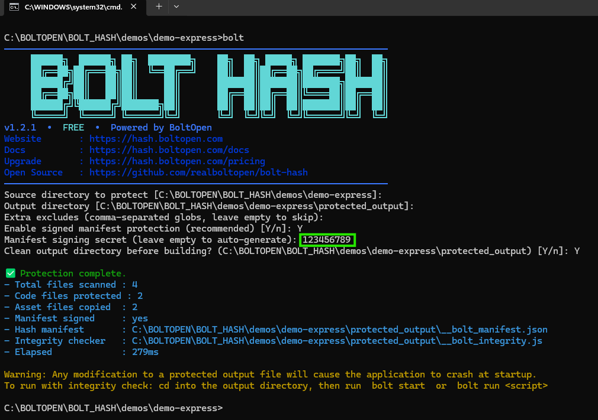
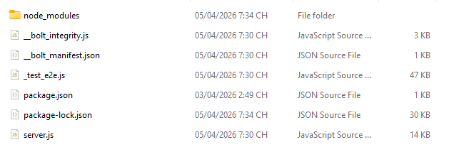
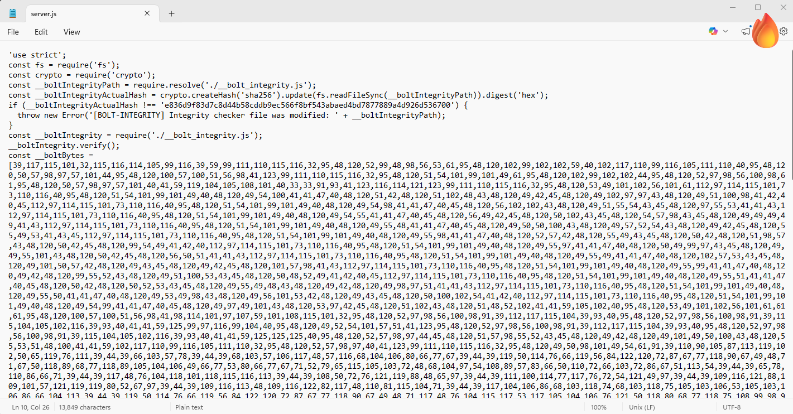
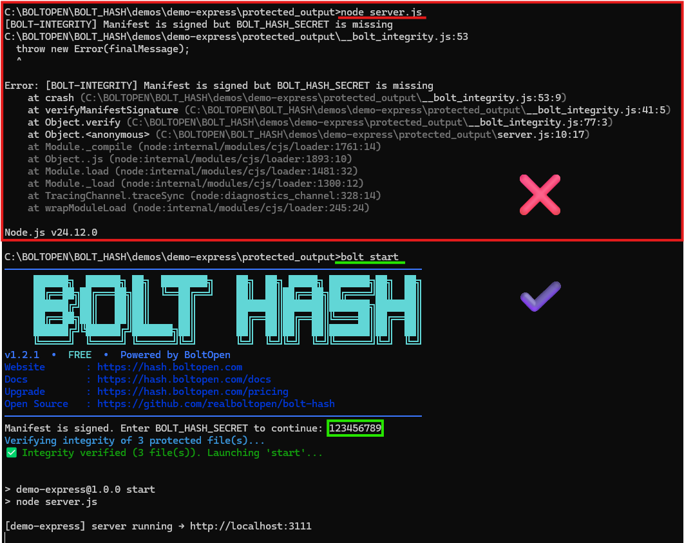

<p align="center">
  
</p>

<h1 align="center">bolt-hash</h1>

<p align="center">
  Protect your Node.js &amp; TypeScript source code — obfuscate, byte-encode,<br>
  and SHA-256 integrity-lock every file before shipping to clients.
</p>

<p align="center">
  <a href="https://www.npmjs.com/package/@realboltopen/bolt-hash"></a>
  <a href="https://www.npmjs.com/package/@realboltopen/bolt-hash"></a>
  <a href="LICENSE"></a>
  <a href="https://nodejs.org"></a>
  
</p>

<p align="center">
  <a href="https://hash.boltopen.com">Website</a> &nbsp;·&nbsp;
  <a href="https://hash.boltopen.com/docs">Docs</a> &nbsp;·&nbsp;
  <a href="https://hash.boltopen.com/pricing">Pricing</a> &nbsp;·&nbsp;
  <a href="https://github.com/realboltopen/bolt-hash">GitHub</a>
</p>

---

## What is bolt-hash?

**bolt-hash** is a CLI tool that protects Node.js and TypeScript projects before you hand the code to a client or deploy to an untrusted server.

It does three things to every `.js` / `.ts` file in your project:

1. **Obfuscates** — variable names, strings, and structure are scrambled
2. **Byte-encodes** — the obfuscated source is stored as a byte array, not readable text
3. **Integrity-locks** — a SHA-256 manifest records the hash of every output file; any modification causes an immediate crash at startup

Non-code files (`package.json`, assets, configs) are copied as-is.

---

## Who is it for?

- **Freelancers & agencies** delivering Node.js / TypeScript backends to clients
- **SaaS vendors** distributing self-hosted installers
- **Teams** that need to ship code to a third-party server without exposing source

> Need to protect **React, Vue, Angular, Next.js, or Nuxt** apps?  
> Need **online license keys**, **device fingerprinting**, **IP restrictions**, **heartbeat kill-timer**, **BGit version control**, or a **web dashboard**?  
> → See [hash.boltopen.com/pricing](https://hash.boltopen.com/pricing) for Premium plans.

---

## Install

```bash
npm install -g @realboltopen/bolt-hash
```

Verify:

```bash
bolt -h
```

---

## How it works — step by step

### 1. Your source project (before)

A normal Node.js / TypeScript project folder.

<p align="center">
  
</p>

---

### 2. Run `bolt` to protect

```bash
cd my-app
bolt
```

The interactive TUI prompts for source dir, output dir, and an optional signing secret.

<p align="center">
  
</p>

---

### 3. Protected output folder

Every `.js` / `.ts` file is now obfuscated and byte-encoded. Two extra files are generated:

- `__bolt_manifest.json` — SHA-256 hashes of all protected files
- `__bolt_integrity.js` — runtime checker loaded by every protected file at startup

<p align="center">
  
</p>

---

### 4. Protected source is unreadable

Opening any protected `.js` file shows byte-encoded, obfuscated code.

<p align="center">
  
</p>

---

### 5. Deploy & run on the client server

```bash
cd protected_output
npm install
bolt start
```

`bolt start` verifies every file hash before launching. Any modification → immediate crash.

<p align="center">
  
</p>

---

## Commands

| Command | Description |
|---|---|
| `bolt` | Protect a project (interactive TUI) |
| `bolt start` | Verify integrity then launch (`npm start`) |
| `bolt run <script>` | Verify integrity then run any npm script |
| `bolt help` / `bolt -h` | Show help |

---

## Signing secret (optional but recommended)

When you enable manifest signing, a random 32-byte hex secret is generated.
This secret HMAC-signs the manifest so an attacker cannot edit files, recompute hashes, and replace the manifest.

`bolt start` will prompt for the secret, or read it from the environment:

```bash
# PowerShell
$env:BOLT_HASH_SECRET="your-secret-here"; bolt start

# Bash / zsh
BOLT_HASH_SECRET="your-secret-here" bolt start
```

Without a secret the manifest uses SHA-256 only (still detects tampering, but not cryptographic forgery).

---

## What gets protected

```
your-project/
├── src/index.ts        ──►  protected_output/src/index.js   (obfuscated + byte-encoded)
├── src/utils.ts        ──►  protected_output/src/utils.js   (obfuscated + byte-encoded)
├── package.json        ──►  protected_output/package.json   (copied as-is)
├── package-lock.json   ──►  protected_output/package-lock.json
│
│   [always excluded]
├── node_modules/
├── .env / .env.*
├── dist/ build/ .next/ .nuxt/
└── .git/
```

---

## Supported project types

bolt-hash supports **server-side Node.js and TypeScript** projects:
Express · Fastify · NestJS · Koa · Hapi · plain Node.js scripts

> **SPA / SSR frameworks** (React, Vue, Nuxt, Next.js, Angular, SvelteKit) require the **Premium** edition.
> → [hash.boltopen.com/pricing](https://hash.boltopen.com/pricing)

---

## Requirements

- Node.js >= 18

---

## License

MIT — see [LICENSE](LICENSE)
