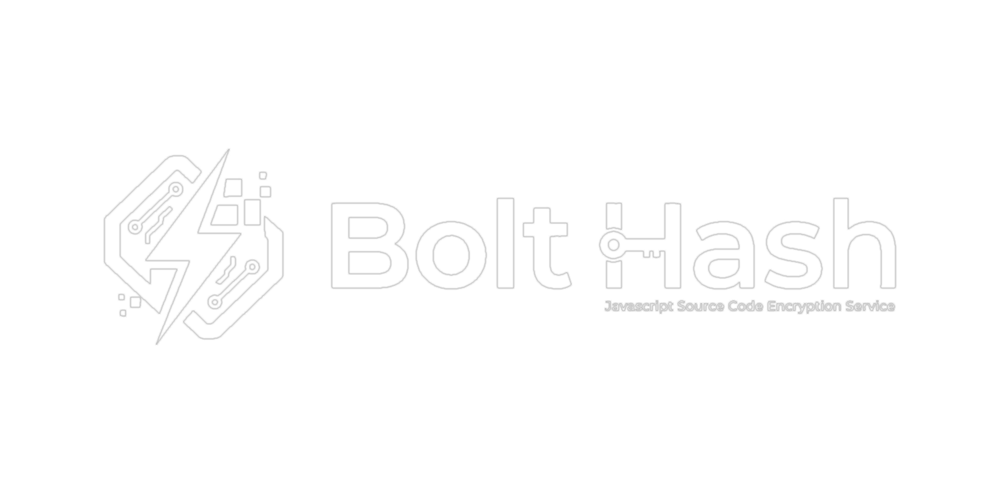

# bolt-hash

<p align="center">
  
</p>

<p align="center">
  <strong>Protect your Node.js / TypeScript source code</strong><br>
  Obfuscates, byte-encodes, and integrity-locks every file.<br>
  Any tampering with the output causes an immediate crash at startup.
</p>

<p align="center">
  <a href="https://hash.boltopen.com">🌐 hash.boltopen.com</a> &nbsp;|&nbsp;
  <a href="https://hash.boltopen.com/docs">📖 Docs</a> &nbsp;|&nbsp;
  <a href="https://hash.boltopen.com/pricing">💳 Pricing</a> &nbsp;|&nbsp;
  <a href="https://hash.boltopen.com/install.sh">📦 Install (Linux/Mac)</a> &nbsp;|&nbsp;
  <a href="https://hash.boltopen.com/install.ps1">📦 Install (Windows)</a>
</p>

---

## Free vs Premium

| Feature | bolt-hash (free) | Starter | Professional | Enterprise |
|---|:---:|:---:|:---:|:---:|
| Obfuscation + byte encoding | ✅ | ✅ | ✅ | ✅ |
| SHA-256 integrity manifest | ✅ | ✅ | ✅ | ✅ |
| HMAC signed manifest | ✅ | ✅ | ✅ | ✅ |
| `bolt start` / `bolt run` | ✅ | ✅ | ✅ | ✅ |
| **Online license key** | — | ✅ | ✅ | ✅ |
| **Device fingerprint limits** | — | ✅ | ✅ | ✅ |
| **IP address restrictions** | — | ✅ | ✅ | ✅ |
| **Installation count limits** | — | ✅ | ✅ | ✅ |
| **Ed25519 source signing** | — | ✅ | ✅ | ✅ |
| **Server signature verify** | — | ✅ | ✅ | ✅ |
| **Cronjob heartbeat** | — | ✅ | ✅ | ✅ |
| **Kill timer** | — | ✅ | ✅ | ✅ |
| **Release version control** | — | ✅ | ✅ | ✅ |
| **SSR source protection** | — | ✅ | ✅ | ✅ |
| **Web dashboard** | — | ✅ | ✅ | ✅ |
| **Bulk key generation** | — | ✅ | ✅ | ✅ |
| **PayPal & Crypto (Web3)** | — | ✅ | ✅ | ✅ |
| **CI/CD integration** (GitHub Actions, GitLab CI…) | — | — | ✅ (500 MB) | ✅ More usage |
| **Priority support chat** | — | — | ✅ | ✅ |

👉 **[Compare plans and sign up → hash.boltopen.com/pricing](https://hash.boltopen.com/pricing)**

---

## Requirements

- Node.js ≥ 18

---

## Installation

```bash
# Free
npm install -g bolt-hash

# Premium (includes everything above + license enforcement)
npm install -g bolt-hash bolt-hash-premium
```

---

## Quick Start

```
[Your source project]  ──►  bolt-hash  ──►  [Protected output]  ──►  bolt start
```

---

## Step 1 — Protect your project

Run this command from **anywhere** (you will be prompted for paths):

```bash
bolt-hash
```

> You can also use the alias: `bolt`

The TUI will ask these questions:

```
Source directory to protect [/your/project]:
Output directory [/your/project/protected_output]:
Extra excludes (comma-separated globs, leave empty to skip) []:
Enable signed manifest protection (recommended) [Y/n]:
Manifest signing secret (required for bolt start verification):
Clean output directory before building? [Y/n]:
```

**Example session:**

```
Source directory to protect [C:\my-app]: C:\my-app
Output directory [C:\my-app\protected_output]:          ← press Enter to accept default
Extra excludes [...]:                                    ← press Enter to skip
Clean output directory before building? [Y/n]: Y

✅ Protection complete.
- Total files scanned : 10
- Code files protected : 7
- Asset files copied  : 3
- Hash manifest       : C:\my-app\protected_output\__bolt_manifest.json
- Integrity checker   : C:\my-app\protected_output\__bolt_integrity.js
- Elapsed             : 1240ms
```

**What you get in the output folder:**

```
protected_output/
├── src/
│   └── index.js          ← obfuscated + byte-encoded (unreadable)
├── package.json          ← copied; .ts scripts auto-patched to .js
├── package-lock.json     ← copied as-is
├── __bolt_manifest.json  ← SHA-256 hash of every protected file
└── __bolt_integrity.js   ← runtime integrity checker
```

When signed-manifest protection is enabled, `__bolt_manifest.json` also includes an HMAC signature.
That signature prevents tampering where an attacker edits files, recomputes hashes, and replaces the manifest.

---

## Step 2 — Deploy & run the protected output

```bash
cd protected_output

# Install dependencies (same as any Node project)
npm install

# Run with integrity check
bolt start
```

`bolt start` does the following **every time** before launching:

1. Reads `__bolt_manifest.json`
2. Verifies manifest signature (when signed) using `BOLT_HASH_SECRET`
3. Recomputes SHA-256 of each protected code file
4. If all checks pass → spawns `npm start`
5. If signature/hash fails or any file is missing → **crashes immediately**

If the manifest is signed and `BOLT_HASH_SECRET` is missing, `bolt start` will ask for it.
You can also provide it directly via environment variable:

```bash
# PowerShell
$env:BOLT_HASH_SECRET="your-secret"; bolt start

# Bash
BOLT_HASH_SECRET="your-secret" bolt start
```

If `package.json` has no `scripts.start`, `bolt start` will prompt you to enter a startup target.
You can provide either a full command or a main file with arguments:

```bash
# Full command
python main.py --val 1

# Main file only (auto-detected runtime)
main.js --port 3000
```

Auto runtime rules for the entered main file:
- `.js/.cjs/.mjs` → runs as `node <file> ...args`
- `.ts/.tsx/.mts/.cts` → runs as `node <file>.js ...args` (after protection)
- `.py` → runs as `python <file> ...args`

```
[BOLT-INTEGRITY] File has been modified or corrupted: src/index.js
Error: [BOLT-INTEGRITY] File has been modified or corrupted: src/index.js
```

---

## Running other npm scripts

Use `bolt run <script>` instead of `npm run <script>`:

```bash
bolt run dev       # same as npm run dev, but verifies hash first
bolt run build
bolt run migrate
```

---

## Workflow summary

| Step | Command | Where to run |
|---|---|---|
| Protect source | `bolt-hash` | source project directory |
| Install deps | `npm install` | protected output directory |
| Start app | `bolt start` (uses `npm start` or asks for startup target if missing) | protected output directory |
| Run any script | `bolt run <script>` | protected output directory |
| Re-protect after edit | `bolt-hash` again | source project directory |

---

## Extra excludes

By default the following are **always excluded** from protection (never obfuscated):

`node_modules` · `.git` · `.env` · `.env.*` · `dist` · `build` · `.next` · `.nuxt`

`package.json` and lock files are **copied** to output (not excluded, not hashed).

You can add more patterns at the TUI prompt, e.g.:

```
Extra excludes: tests/**,docs/**,scripts/seed.ts
```

---

## tsconfig path aliases

If your project uses `compilerOptions.paths` in `tsconfig.json`, bolt-hash resolves and rewrites them automatically:

```json
{
  "compilerOptions": {
    "baseUrl": ".",
    "paths": {
      "@/*": ["src/*"]
    }
  }
}
```

`import { foo } from '@/utils/foo'` → rewritten to the correct relative path in output.

---

## Known limitations

| Scenario | Status |
|---|---|
| Dynamic `require(variable)` | ⚠️ Cannot be statically analysed — left as-is |
| Webpack / Vite / Bun custom loaders | ⚠️ Non-standard resolution not supported |
| ESM `package.json` subpath exports | ⚠️ Not evaluated |

---

## ⚡ bolt-hash-premium

bolt-hash-premium wraps `bolt-hash` with license enforcement, device fingerprinting, heartbeat monitoring, and kill-timer control.

### Install

```bash
npm install -g bolt-hash bolt-hash-premium
```

### Quick start (2 commands)

```bash
# 1. Set your license key once
bhp set license BH-XXXX-XXXX-XXXX-XXXX

# 2. Navigate to your app and start
cd my-app
bhp start
```

`bhp start` automatically:
- Verifies your license online
- Detects how to launch your app (see runtime detection below)
- Starts a heartbeat cronjob (keeps the server aware your instance is running)
- Enforces the kill timer defined on your license

### All `set` commands

| Command | Effect |
|---|---|
| `bhp set license BH-XXXX-...` | Save license key |
| `bhp set server https://your-server` | Point to a custom license server |
| `bhp set apikey BHK-XXXX-...` | Save a third-party API key (for SDK integrations) |
| `bhp set secret [VALUE]` | Manually set or rotate the manifest signing secret |

### View your config

```bash
bhp config --show
```

Output:

```
License Key     : BH-E30C85B3...  (active, expires 2027-03-25)
API Key         : (not set)        bhp set apikey BHK-...
Server URL      : http://localhost:3888
Manifest Secret : a3f9b2...        bhp set secret  to rotate
Config file     : C:\Users\you\.bolt-hash-premium\config.json
Device ID       : win32-HOSTNAME-xxxxxxxx
Hostname        : HOSTNAME
OS              : Windows 11
```

---

### Runtime auto-detection

`bhp start` detects how to launch your app in this order:

| Detection | Trigger | Command run |
|---|---|---|
| `package.json` `scripts.start` | any `start` script present | `npm start` |
| Next.js | `next` in `dependencies` | `next start` or `next dev` |
| Nuxt 3 | `nuxt` in `dependencies` | `nuxt start` or `nuxt dev --port` |
| NestJS | `@nestjs/core` in `dependencies` | `nest start --watch` |
| TypeScript / tsx | `tsx` in deps, `src/*.ts` present | `tsx src/index.ts` |
| Plain JS | fallback | `node index.js` |

> Works with: Express · Next.js · Nuxt 3 · NestJS · TypeScript (tsx) · Vue · Angular · plain Node.js

### Manifest signing secret

On your **first** `bhp protect` with a premium license, a 32-byte random secret is auto-generated and saved to `~/.bolt-hash-premium/config.json`. `bhp start` loads it automatically — no manual input needed.

For CI/CD pipelines inject it via environment variable:

```bash
# .env or CI secret
BOLT_HASH_SECRET=a3f9b2c1...

# Then just run
bhp start
```

To rotate the secret:

```bash
bhp set secret           # generates a new random secret
bhp set secret myvalue   # or provide your own (min 16 chars)
```

---

### Protect your project (premium flow)

```bash
cd my-source-app
bhp protect
```

With a premium license, `bhp protect` asks only **3 questions** (signing is automatic):

```
Source directory to protect [/your/app]:
Output directory [/your/app/protected_output]:
Clean output directory before building? [Y/n]:

✅ Manifest signing secret auto-generated and saved to config.
✅ Protection complete.
```

---

### Third-party API keys

Users can create API keys from the web dashboard and use them to authenticate SDK calls:

```bash
# Create via dashboard → copy key
# Use in your integration
curl -H "X-API-Key: BHK-xxxx-xxxx" https://your-server/api/user/api-keys
```

Or set one locally for SDK usage:

```bash
bhp set apikey BHK-xxxx-xxxx-xxxx-xxxx
```

---

### Status check

```bash
bhp status
```

```
✅ License is valid
  Project     : My App
  Status      : active
  Expires     : 2027-03-25
  Devices     : 1/5
  Runs        : 3/30
  Kill Time   : 300s
```

---

### OS notification on expiry

When a license expires during a running session, bolt-hash-premium sends a desktop notification (Windows/macOS/Linux) so operators are alerted without checking logs.

---

### E2E verified runtimes

| Runtime | Demo project | Port | Result |
|---|---|---|---|
| Express | `demos/demo-express` | 3000 | ✅ passed |
| TypeScript (tsx) | `demos/demo-typescript` | 3001 | ✅ passed |
| Next.js 14 | `demos/demo-nextjs` | 3010 | ✅ passed |
| Nuxt 3 | `demos/demo-nuxt` | 3020 | ✅ passed |
